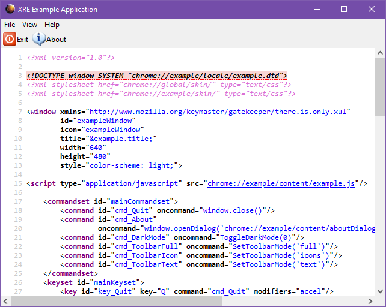

# XRE Example
Simple example application showing how to make XRE/XULRunner applications.
Mozilla will tell you that XULRunner was deprecated, but you can still use it in modern
Firefox!



To run this application, do the following command:
```
firefox -app /path/to/xre-example/application.ini
```

## What is everything?

- `application.ini` - to specify application info
- `chrome.manifest` - to register chrome URLs used by your app
- `chrome/content/` - houses content, the path of this folder is specified by `chrome.manifest`
- `chrome/skin/` - houses skin content. These days it's mainly just used by Mozilla for OS distinction, since complete themes are gone and the skin is hardcoded to `classic/1.0`.
- `chrome/locale/` - houses localization files.
- `chrome/icons/default` - houses icons. To use an icon from here, set the `icon` attribute of your root element to the name of the icon.
- `defaults/preferences/prefs.js` - in this file, you need to set the pref `toolkit.defaultChromeURI`
to the URL of your application

See more about chrome registration [here](https://github.com/mozilla/gecko-dev/blob/30afd6631333bf83d5c62ca48c313d96a21b4bbd/build/docs/chrome-registration.rst).